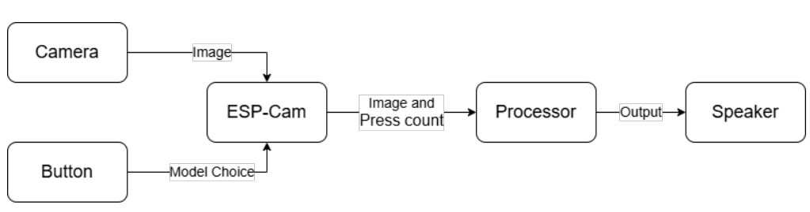

# Smart AI Spectacle — Assistive Wearable for the Visually Impaired  
_A project by Gokul Subedi, Samir Bhattarai, and Krish Gurung_

---

## 🎥 Demo Showcase

### 📌 What Was Planned  
🧠 Our original vision included a complete smart reading system capable of real-time OCR, segmentation, and audio playback — all offline.

🎯 Watch our planned concept video:  
👉 [📹 Vision & Planned Video](https://drive.google.com/file/d/1bvSfbsYHHhIE6tTSr1Md4ksHpTwNekQm/view?usp=drive_link)

📚 The book reading part of this vision evolved into a standalone project:
by _Arjun & Sushmeet_
👉 **[Book Reader — See Repository](https://github.com/MeSafal/readingAssistant)**

---

### ✅ What Was Achieved  
🚀 Here’s what we successfully built and demonstrated:  
👉 [📽️ Project Demo Video](https://drive.google.com/file/d/1WOk6OGF2B9G4DnmsZEBukvpV3pstKnXK/view?usp=drive_link)

---

### 🎉 Fun Behind the Scenes  
😄 Engineering has its moments — here’s a lighthearted look behind the build process:  
👉 [🎬 Watch Fun/Bloopers Video](https://drive.google.com/file/d/1OVX2-oNFI8HZVuiPecNrl6nQ6l_yAgpX/view?usp=drive_link)

---

---

## 🎞️ Project Video Library

> 💡 Explore everything me and my team have built — from our early vision to final execution and fun behind-the-scenes moments.

👉 [📁 Access All Project Videos on Google Drive](https://drive.google.com/drive/folders/1XJ2Pygg4lbet_aBQyB7b7QG9pEV38vye?usp=drive_link)

_This shared folder contains planning, demo, and fun recordings for full transparency and storytelling._

---


## 📜 Overview

The **Smart AI Spectacle** is a revolutionary wearable device that assists visually impaired individuals by providing real-time audio feedback about their surroundings, identifying Nepalese currency, and recognizing familiar faces. Developed as a Bachelor’s degree project at Tribhuwan University, Nepal, it leverages advanced AI models (ResNet-18, ResNet-50, and LSTM/Blip) and an ESP32-Cam to process images, delivering audio descriptions via a Text-to-Speech (TTS) engine. This innovative solution enhances independence and accessibility, turning eyewear into a smart guide that describes the environment, detects money, and identifies people—all through seamless hardware and software integration.

For full technical details, see the [Project Report](final_project_smart_AI_spectacle.pdf).

## 📝 Introduction

### Background
Globally, approximately 285 million people are visually impaired, with many facing significant challenges in navigating their environments, managing finances, or recognizing people without assistance. In Nepal, limited access to advanced assistive technologies exacerbates these issues, leaving individuals reliant on caregivers for daily tasks.

### Problem Definition
Visually impaired individuals often struggle with spatial awareness, currency identification, and social interaction due to the lack of affordable, real-time assistive solutions. This project addresses these gaps by offering a wearable AI-powered device that reduces dependency and improves quality of life.

### Objectives
- **Develop** a wearable AI system for real-time environmental awareness and recognition.
- **Implement** deep learning models to classify scenes, currency, and faces.
- **Deploy** the system on eyewear with ESP32-Cam and laptop processing.
- **Deliver** audio feedback via TTS for an intuitive user experience.
- **Demonstrate** a proof-of-concept prototype for visually impaired users.

## 🎥 Demo

- ![Placeholder for Hardware Image] (Stunning eyewear setup image to be added.)
- ![Placeholder for Sample Output Image] (Example of currency/face recognition output to be included.)


All demo assets will be in the `images/` folder.  
_Assets are from [Project Report](final_project_smart_AI_spectacle.pdf), may be a bit blurry._

## ✨ Features

- **Real-time Scene Description** with ResNet-50 and LSTM/Blip
- **Currency Identification** using ResNet-18 for Nepalese denominations
- **Face Recognition** with ResNet-50 and custom Haar cascade detection
- **Wireless Communication** via ESP32-Cam WiFi hotspot
- **Audio Feedback** via pyttsx3 TTS engine
- **Modular Design**: Sender (ESP32-Cam) / Receiver (laptop) architecture

## 🛠️ Hardware Components

| Component          | Description                                 |
|--------------------|---------------------------------------------|
| ESP32-Cam          | Captures images and handles button inputs   |
| Push Buttons       | Controls power supply and workflow          |
| Buck Converter     | Regulates power for stable operation        |
| Speaker            | Delivers audio feedback                     |
| Eyewear            | Houses the impressive hardware setup        |
| Laptop             | Processes AI models with CUDA-capable GPU   |

## 💻 Software & Libraries

- **Python 3.x**
- **TensorFlow** (CUDA 12.6 compatible)
- **OpenCV**, **NumPy**, **PyTorch**, **transformers**, **pyttsx3**
- C/C++ for ESP32 programming
- Visual Studio Code and Arduino IDE for development

## 🗺️ System Architecture & Flowchart

- 
- 
- 


```text
ESP32-Cam → Image Capture → WiFi → Laptop → AI Models → TTS → Speaker → Audio Feedback
```

## 🔄 Control Mapping & Safety

| Button Press       | Action                          |
|--------------------|---------------------------------|
| 1 Press            | Activate Face Recognition       |
| 2 Presses          | Activate Currency Identification|
| 3+ Presses         | Activate Scene Description      |

**Safety**: Power button ensures controlled activation/deactivation of the ESP32-Cam.

## 📐 Component Roles

### ESP32-Cam
Acts as sender: captures images and sends them with button press count via WiFi hotspot.

### Laptop
Acts as receiver: processes images with AI models and generates audio output via TTS.

## 📡 Communication & Control Functions

```python
# (High-level functions implied, code available in repo)
# Image processing and audio generation handled by master.py
```

## 📈 Model Performance

- **Currency Identification**: ~98% validation accuracy, with rare misclassifications.
- **Face Recognition**: High accuracy for known faces, with some overfitting.
- **Scene Description**: Strong BLEU scores, though validation loss plateaus slightly.

## 🚧 Limitations & Future Work

- **Prototype Only**: Tested in controlled environments.
- **Laptop-Dependent**: Requires a CUDA-capable GPU.
- **No Offline Mode**: Relies on WiFi and laptop processing.
- **Limited Dataset**: Further data collection needed for edge cases.

**Next Steps**:  
- Add offline processing capability
- Enhance model accuracy with larger datasets
- Develop a standalone wearable unit
- Improve battery life and portability

## 🎓 Project Status

Proof of Concept with real-time audio feedback. Ready for user testing and hardware optimization.

## 👥 Project Contributors

_All contributors collaborated closely on all aspects of the project, from concept to implementation._

- **Gokul Subedi** — Software Engineer & System Designer  
- **Samir Bhattarai** — Hardware Engineer & System Designer  
- **Krish Gurung** — Data Scientist & System Designer  

## 🤝 Supported By

> **Arjun Koirala and Sushmeet Paudel**  
> _Pillar of Strength & Development Champions_  

This project proudly celebrates the exceptional support, dedication, and invaluable contributions of **Arjun Koirala and Sushmeet Paudel**, whose efforts have been a cornerstone of our development and deployment success.

---

## 🤝 License & Contribution

©️ All rights reserved by Gokul Subedi, Samir Bhattarai, and Krish Gurung.  
Licensed under the [MIT License](https://opensource.org/licenses/MIT).

If you’re eager to collaborate, offer support, or share suggestions, my team and I are open to working with you. Reach out at [github.com/meSafal](https://github.com/meSafal) or [subedigokul119@gmail.com](mailto:subedigokul119@gmail.com).

---

## 🏫 Acknowledgments

- Arjun Koirala and @Sushmit Paudel for exceptional support. 
- Kaggle community and open-source contributors

---

## 📌 Project Status

- ✅ Prototype deployed and tested successfully
- ✅ Real-time performance with offline playback
- 🔄 Roadmap includes dynamic TTS and support for mobile deployment

---

> ⚠️ This is a public-sharing copy. Dataset and select training scripts are withheld.

> ⚠️ All images in here are added from the project report itself.

<sub><p align="center">📘 This repository and its documentation were prepared and maintained by <a href="https://github.com/MeSafal/" target="_blank"><u><strong>Gokul Subedi</strong></u></a>. For the latest updates and related projects, visit <a href="https://github.com/MeSafal" target="_blank">github.com/MeSafal</a>.</p></sub>
