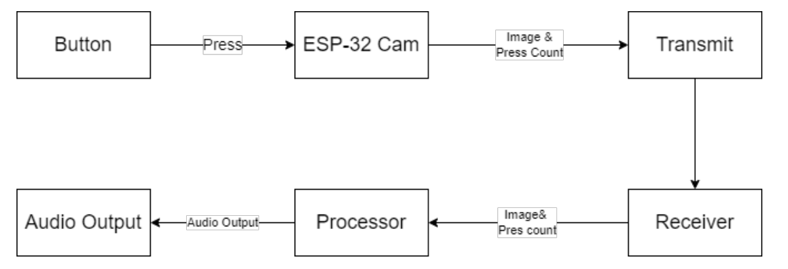
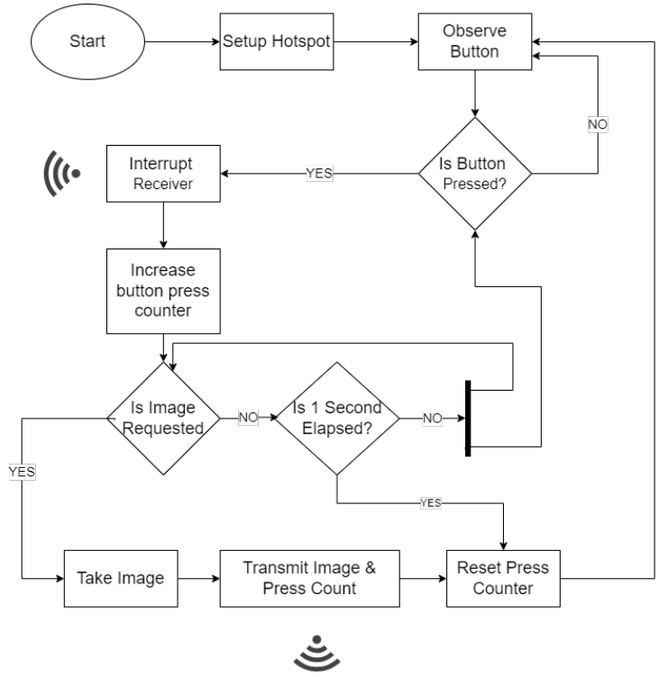

# Smart AI Spectacle — Assistive Wearable for the Visually Impaired  
_A project by Gokul Subedi, Samir Bhattarai, and Krish Gurung_

---

## 🎥 Demo Showcase

### 📌 What Was Planned  
🧠 Our original vision included a complete visually impaired support Including - Reading Assistant, Scene Description, Face Recognition and Nepali Currency Identification.

🎯 Watch our planned concept video:  
👉 [📹 Vision & Planned Video](https://drive.google.com/file/d/1bvSfbsYHHhIE6tTSr1Md4ksHpTwNekQm/view?usp=drive_link)

📚 The book reading part of this vision evolved into a standalone project:
by _Arjun & Sushmeet_

👉 **[Book Reader — See Repository](https://github.com/MeSafal/readingAssistant)**

---

### ✅ What Was Achieved  
🚀 Here’s what we successfully built and demonstrated:  
👉 [📽️ Project Demo Video](https://drive.google.com/file/d/1WOk6OGF2B9G4DnmsZEBukvpV3pstKnXK/view?usp=drive_link)

---

### 🎉 Fun Behind the Scenes  
😄 Engineering has its moments — here’s a lighthearted look behind the build process:  
👉 [🎬 Watch Fun/Bloopers Video](https://drive.google.com/file/d/1OVX2-oNFI8HZVuiPecNrl6nQ6l_yAgpX/view?usp=drive_link)

---


## 🎞️ Project Video Library

> 💡 Explore everything me and my team have built — from our early vision to final execution and fun behind-the-scenes moments.

👉 [📁 Access All Project Videos on Google Drive](https://drive.google.com/drive/folders/1XJ2Pygg4lbet_aBQyB7b7QG9pEV38vye?usp=drive_link)

_This shared folder contains planning, demo, and fun recordings for full transparency and storytelling._

---


## 📜 Overview

The **Smart AI Spectacle** is a revolutionary wearable device that assists visually impaired individuals by providing real-time audio feedback about their surroundings, identifying Nepalese currency, and recognizing familiar faces. Developed as a Bachelor’s degree project at Tribhuwan University, Nepal, it leverages advanced AI models (ResNet-18, ResNet-50, and LSTM/Blip) and an ESP32-Cam to process images, delivering audio descriptions via a Text-to-Speech (TTS) engine. This innovative solution enhances independence and accessibility, turning eyewear into a smart guide that describes the environment, detects money, and identifies people—all through seamless hardware and software integration.

For full technical details, see the [Project Report](final_project_smart_AI_spectacle.pdf).

## 🎥 Demo

- ![Placeholder for Hardware Image] (Stunning eyewear setup image to be added.)
- ![Placeholder for Sample Output Image] (Example of currency/face recognition output to be included.)


All demo assets will be in the `images/` folder.  
_Assets are from [Project Report](final_project_smart_AI_spectacle.pdf), may be a bit blurry._

---
## ✨ Features

- **Real-time Scene Description** with ResNet-50 and LSTM/Blip
- **Currency Identification** using ResNet-18 for Nepalese denominations
- **Face Recognition** with ResNet-50 and custom Haar cascade detection
- **Wireless Communication** via ESP32-Cam WiFi hotspot
- **Audio Feedback** via pyttsx3 TTS engine
- **Modular Design**: Sender (ESP32-Cam) / Receiver (laptop) architecture

---
## 📦 System Operation Phases

This project is built around a robust **Master–Slave architecture**, split into two core functional phases:

- 🛰️ **Slave Phase** – Managed by the ESP32-CAM (image capture + communication)
- 🧠 **Master Phase** – Managed by the Laptop (image processing + AI inference + TTS)

---

### 🛰️ Slave Phase — ESP32-CAM Logic

The ESP32-CAM acts as a dedicated lightweight image sender and input handler. Its responsibilities are minimal but mission-critical.

#### 🔁 Always-On Listener Mode
- The ESP32 remains in an idle loop, doing nothing until a **physical button press** is detected.
- Upon the first press, it immediately enters the **Active Zone**.

#### 🔗 Signal to Master
- After activation, ESP sends a **notification signal** to the laptop (Master), indicating readiness and button press count.
- It then waits for a formal **image request** from the laptop.

#### 🔔 Button Interrupt Handling
- Each button press is **counted**, starting from 1.
- Multiple presses during this state are logged without interfering with image capture.

#### 📷 Image Capture & API Delivery
- Once the master sends the image request, ESP:
  - Captures a new image
  - Sends it via a secured API call (with the button press count in the header)
  - Returns immediately to the idle loop

#### 🕒 Timeout Logic
- If the laptop doesn’t respond within **1 second**, ESP:
  - Assumes the master is busy or unreachable
  - Cancels the interaction
  - Flushes the button count
  - Returns to idle mode (no image is captured)

#### 📡 Offline-Ready Communication
- ESP and laptop operate via their **own hosted WiFi hotspot**.
- The system does **not rely on external networks** or internet connectivity.
- This design ensures full functionality even in remote or disconnected environments — like dense urban areas, rural villages, or even forested zones.

📌 This lightweight, interrupt-driven approach ensures ESP remains **responsive**, **efficient**, and always ready to serve when the master system is available.

## 🧠 Master Phase — Laptop Logic

Upon receiving the ESP32-CAM’s button-press interruption, the laptop (Master) orchestrates the heavy lifting: model selection, image request, inference, and audio output.

---

### ⏱️ Debounce & Mode Selection (0.9 s Window)
- **Wait 0.9 seconds** after the first interrupt to collect additional presses:
  - **1 press** → Face Recognition  
  - **2 presses** → Currency Identification  
  - **3+ presses** → Scene Description  
- This 0.9 s window ensures all user intents arrive before the ESP times out at 1 s.

---

### 🔗 Image Request
- After 0.9 s, Master sends an **“Image Request”** signal back to the ESP.
- ESP then captures and streams the image + press count via the secured API.

---

### 🖼️ Image Reception & Preprocessing

1. **Reception**  
   - Receives the raw image data and associated button-press count via API.

2. **Preprocessing**  
   - Converts the image into a model-compatible format using the **same preprocessing pipeline** applied during model training (e.g., resizing, normalization, color-space conversion).

3. **Implementation Detail**  
   - For added robustness and modularity, preprocessing logic may reside within individual model pipelines. This ensures each model explicitly applies its expected preprocessing steps before inference.


---

### 🤖 Model Inference
- **Route** image to the correct AI model based on button count:
  1. Face Recognition  
  2. Money Identification  
  3. 3+ Scene Description  
- **Await** model output (all models run locally on the laptop).

---

### 🔊 Audio Feedback
- **Convert** the model’s text output to speech via the default playback engine.  
- **Play** audio on the active speaker in a separate thread, so UI remains responsive.

---

### 🚫 Interrupt Handling
- **While processing**, any new ESP interrupts are **ignored**:
  - Master does **not** send a new request, causing ESP to timeout and flush.  
- **Exception**: During longer Scene Description inference, rapid presses can preempt a new cycle—demonstrating robust ignore logic.

---

### 🔄 Fallback & Flexibility
- **No ESP?** Master can:
  1. Use any connected camera (e.g., USB webcam)  
  2. Accept keyboard input (`1`, `2`, `3`) to select mode  
- This “offline, hardware-agnostic” design proves Master’s versatility beyond the ESP32 hotspot.

---

> 📌 **Note:** The Master–Slave handshake (0.9 s wait + 0.1 s ESP timeout) ensures reliable, user-friendly operation in any environment—urban, rural, or off-grid.  

## 🛠️ Hardware Components

| Component          | Description                                 |
|--------------------|---------------------------------------------|
| ESP32-Cam          | Captures images and handles button inputs   |
| Push Buttons       | Controls power supply and workflow          |
| Buck Converter     | Regulates power for stable operation        |
| Speaker            | Delivers audio feedback                     |
| Eyewear            | Houses the impressive hardware setup        |
| Laptop             | Processes AI models with CUDA-capable GPU   |

## 💻 Software & Libraries

- **Python 3.x**
- **TensorFlow** (CUDA 12.6 compatible)
- **OpenCV**, **NumPy**, **PyTorch**, **transformers**, **pyttsx3**
- C/C++ for ESP32 programming
- Visual Studio Code and Arduino IDE for development

## 🗺️ System Architecture & Flowchart

- 
- 
- 


```text
ESP32-Cam → Image Capture → WiFi → Laptop → AI Models → TTS → Speaker → Audio Feedback
```

## 🔄 Control Mapping & Safety

| Button Press       | Action                          |
|--------------------|---------------------------------|
| 1 Press            | Activate Face Recognition       |
| 2 Presses          | Activate Currency Identification|
| 3+ Presses         | Activate Scene Description      |

**Safety**: Power button ensures controlled activation/deactivation of the ESP32-Cam.

---
## 📡 Communication & Control Functions

```python
# (High-level functions implied, code available in repo)
# Image processing and audio generation handled by master.py
```

## 📈 Model Performance

- **Currency Identification**: ~98% validation accuracy, with rare misclassifications.
- **Face Recognition**: High accuracy for known faces, with some overfitting.
- **Scene Description**: Strong BLEU scores, though validation loss plateaus slightly.

## 🚧 Limitations & Future Work

- **Prototype Only**: Tested in controlled environments.
- **Laptop-Dependent**: Requires a CUDA-capable GPU.
- **No Offline Mode**: Relies on WiFi and laptop processing.
- **Limited Dataset**: Further data collection needed for edge cases.

**Next Steps**:  
- Add offline processing capability
- Enhance model accuracy with larger datasets
- Develop a standalone wearable unit
- Improve battery life and portability

## 🎓 Project Status

Proof of Concept with real-time audio feedback. Ready for user testing and hardware optimization.

## 👥 Project Contributors

_All contributors collaborated closely on all aspects of the project, from concept to implementation._

- **Gokul Subedi** — Software Engineer & System Designer  
- **Samir Bhattarai** — Hardware Engineer & System Designer  
- **Krish Gurung** — Data Scientist & System Designer  

## 🤝 Supported By

> **Arjun Koirala and Sushmeet Paudel**  
> _Pillar of Strength & Development Champions_  

This project proudly celebrates the exceptional support, dedication, and invaluable contributions of **Arjun Koirala and Sushmeet Paudel**, whose efforts have been a cornerstone of our development and deployment success.

---

## 🤝 License & Contribution

©️ All rights reserved by Gokul Subedi, Samir Bhattarai, and Krish Gurung.  
Licensed under the [MIT License](https://opensource.org/licenses/MIT).

If you’re eager to collaborate, offer support, or share suggestions, my team and I are open to working with you. Reach out at [github.com/meSafal](https://github.com/meSafal) or [subedigokul119@gmail.com](mailto:subedigokul119@gmail.com).

---

## 🏫 Acknowledgments

- Arjun Koirala and @Sushmit Paudel for exceptional support. 
- Kaggle community and open-source contributors

---

## 📌 Project Status

- ✅ Prototype deployed and tested successfully
- ✅ Real-time performance with offline playback
- 🔄 Roadmap includes dynamic TTS and support for mobile deployment

---

> ⚠️ This is a public-sharing copy. Dataset and select training scripts are withheld.

> ⚠️ All images in here are added from the project report itself.

<sub><p align="center">📘 This repository and its documentation were prepared and maintained by <a href="https://github.com/MeSafal/" target="_blank"><u><strong>Gokul Subedi</strong></u></a>. For the latest updates and related projects, visit <a href="https://github.com/MeSafal" target="_blank">github.com/MeSafal</a>.</p></sub>
